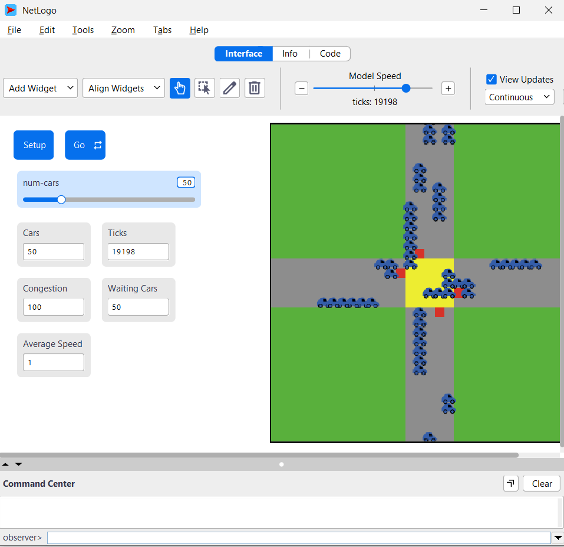
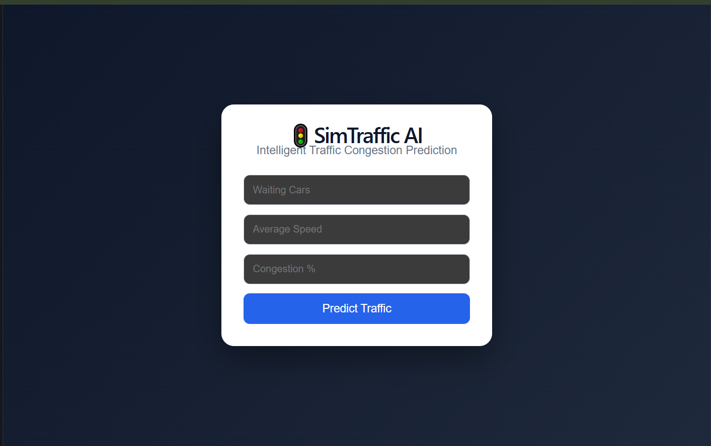
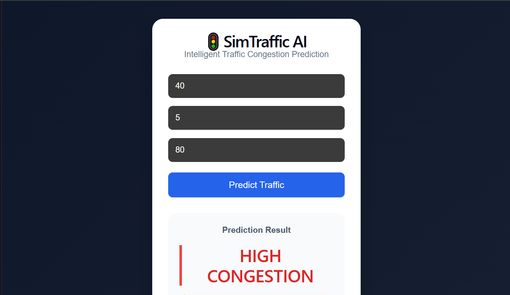
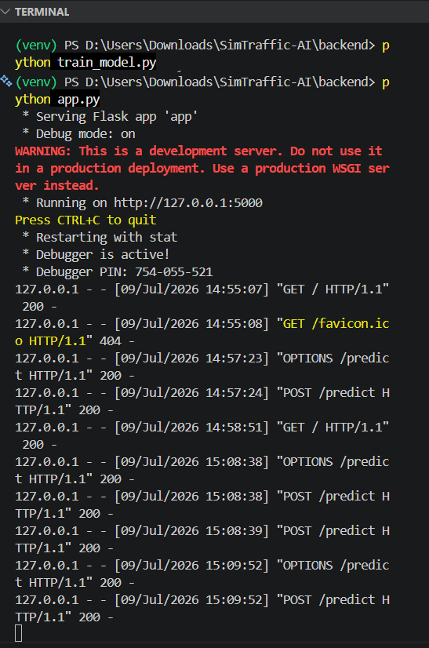

# 🚦 SimTraffic AI

> **Simulation-Based Intelligent Traffic Management System using NetLogo, Machine Learning, Flask, and React**


SimTraffic AI is an intelligent traffic congestion prediction system that combines traffic simulation, machine learning, and a modern web dashboard. The system simulates vehicle movement in NetLogo, collects traffic data, trains a machine learning model, and predicts traffic congestion through a React-based user interface.

---

## 📌 Features

- 🚗 Traffic simulation using NetLogo
- 📊 Automatic traffic dataset generation
- 🤖 Machine Learning congestion prediction
- 🌐 REST API built with Flask
- ⚛️ Modern React dashboard
- 📈 Traffic data visualization
- 🔍 Real-time congestion prediction

---

## 🛠️ Technology Stack

| Technology | Purpose |
|------------|---------|
| NetLogo | Traffic Simulation |
| Python | Data Processing |
| Pandas | Dataset Analysis |
| Scikit-learn | Machine Learning |
| Flask | Backend REST API |
| React | Frontend Dashboard |
| Vite | React Development |
| Git & GitHub | Version Control |

---

# 📂 Project Structure

```
SimTraffic-AI/
│
├── backend/
│   ├── app.py
│   ├── train_model.py
│   ├── analyze.py
│   ├── predict.py
│   ├── traffic_model.pkl
│   └── requirements.txt
│
├── dataset/
│   └── traffic_data.csv
│
├── frontend/
│   ├── src/
│   ├── public/
│   ├── package.json
│   └── vite.config.js
│
├── simulation/
│   └── traffic_model.nlogo
│
├── screenshots/
│   ├── netlogo.png
│   ├── dashboard.png
│   ├── prediction.png
│   └── backend_api.png
│
└── README.md
```

---

# ⚙️ Installation

## 1️⃣ Clone Repository

```bash
git clone https://github.com/Navodya52/SimTraffic-AI.git
cd SimTraffic-AI
```

---

## 2️⃣ Backend Setup

```bash
cd backend

python -m venv venv

venv\Scripts\activate

pip install -r requirements.txt
```

---

## 3️⃣ Run Flask Server

```bash
python app.py
```

Server will start at

```
http://127.0.0.1:5000
```

---

## 4️⃣ Frontend Setup

```bash
cd frontend

npm install

npm run dev
```

Open

```
http://localhost:5173
```

---

# 🧠 Machine Learning Model

The machine learning model is trained using traffic simulation data generated from NetLogo.

### Input Features

- Waiting Cars
- Average Speed
- Congestion Percentage

### Output

- HIGH CONGESTION
- LOW CONGESTION

---

# 🚀 How It Works

```
NetLogo Simulation
        │
        ▼
Traffic Dataset (.csv)
        │
        ▼
Python Data Analysis
        │
        ▼
Machine Learning Training
        │
        ▼
traffic_model.pkl
        │
        ▼
Flask REST API
        │
        ▼
React Dashboard
        │
        ▼
Traffic Congestion Prediction
```

---

# 📊 Screenshots

## 🚦 NetLogo Traffic Simulation



---

## 💻 React Dashboard



---

## 📈 Traffic Prediction



---

## 🔌 Flask Backend API



---

# 📁 Dataset

The dataset contains traffic information generated through NetLogo simulation.

Example fields:

| Column | Description |
|---------|-------------|
| tick | Simulation tick |
| waiting_cars | Number of waiting vehicles |
| congestion | Congestion percentage |
| average_speed | Average vehicle speed |

---

# 📡 API Endpoint

## POST `/predict`

### Request

```json
{
  "waiting_cars": 40,
  "average_speed": 10,
  "congestion": 80
}
```

### Response

```json
{
  "prediction": "HIGH CONGESTION"
}
```

---

# 👩‍💻 Author

**Nishadi Wickramaarachchi**

- 🎓 B.Comp (Hons) in Software Engineering
- 🏫 Faculty of Computing
- 📍 University of Sri Jayewardenepura

GitHub:
https://github.com/Navodya52

---

# ⭐ Future Improvements

- Live traffic visualization
- Real-time sensor integration
- Cloud deployment (Azure)
- Multiple intersection prediction
- Interactive traffic analytics dashboard

---

# 📄 License

This project is developed for educational and research purposes.

---

⭐ If you found this project useful, consider giving it a star on GitHub.
