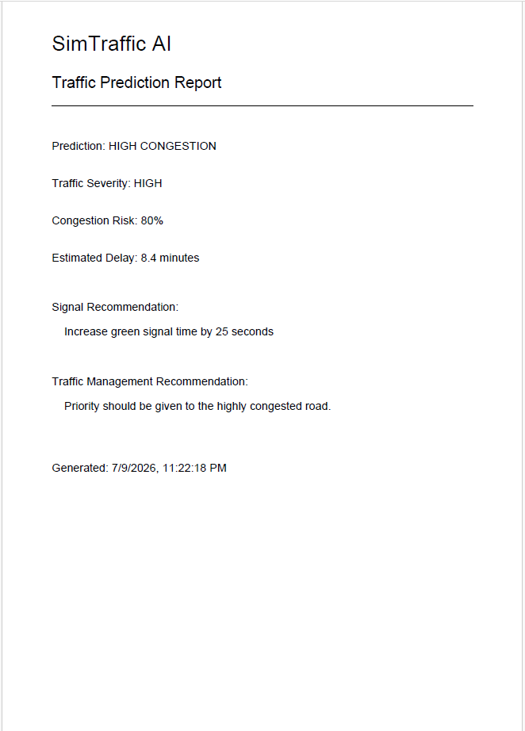
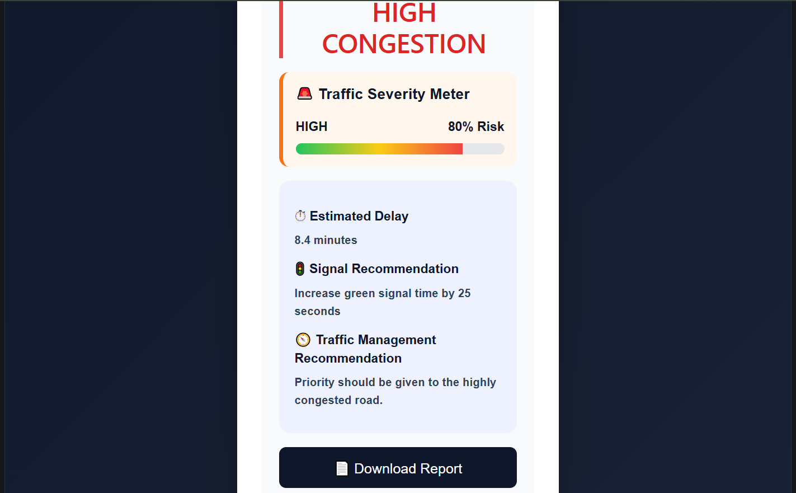
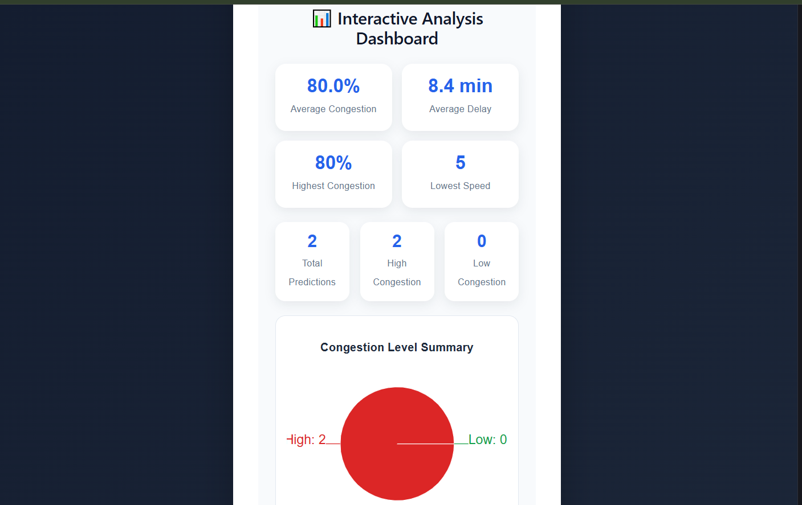
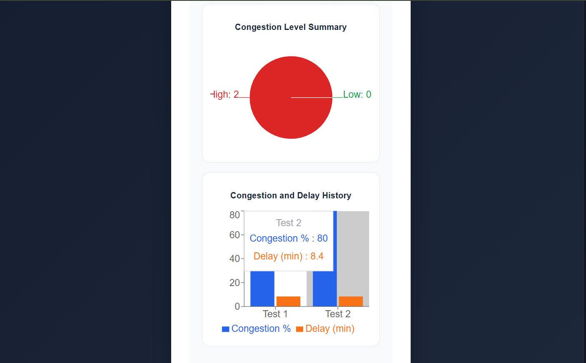
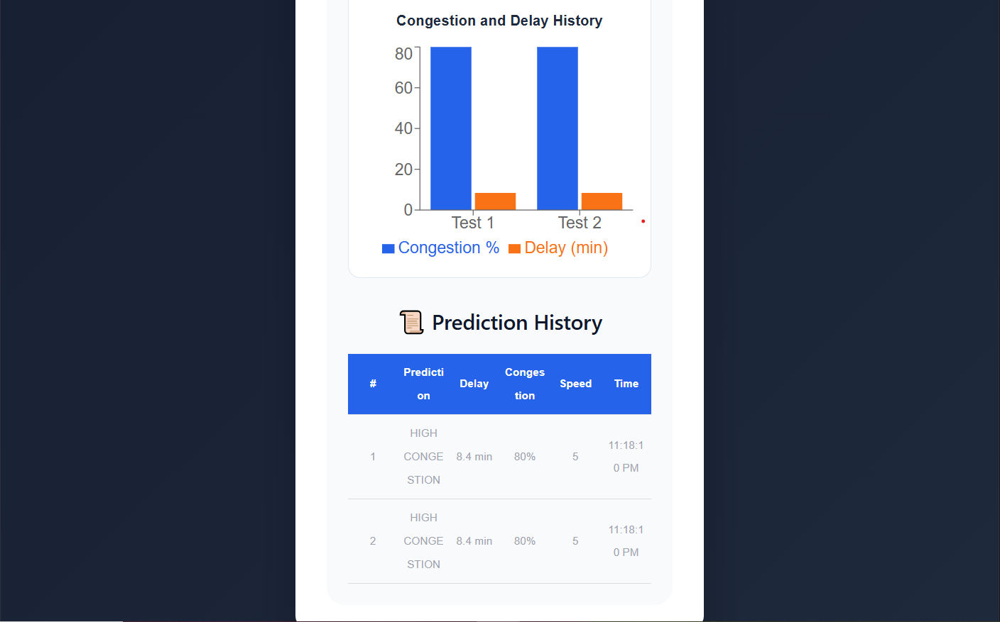

# 🚦 SimTraffic AI

> **Simulation-Based Intelligent Traffic Management System using NetLogo, Machine Learning, Flask and React**


---

# 📌 Project Overview

SimTraffic AI is an intelligent traffic congestion prediction and traffic management system developed using **Machine Learning**, **NetLogo Simulation**, **Flask REST API**, and **React.js**.

The system simulates road traffic using NetLogo, generates traffic datasets, trains a Machine Learning model, predicts congestion levels, and provides intelligent traffic management recommendations through a modern interactive dashboard.

Unlike a traditional traffic prediction project, SimTraffic AI also provides practical decision support for traffic controllers by estimating vehicle delay and recommending adaptive traffic signal timing.

---

# ✨ Features

- 🚗 NetLogo Traffic Simulation
- 🤖 AI-Based Traffic Congestion Prediction
- 📈 Machine Learning Model (Scikit-Learn)
- ⏱ Realistic Traffic Delay Estimation
- 🚦 Smart Signal Timing Recommendation
- 🧭 Traffic Management Recommendation
- 🚨 Traffic Severity Meter
- 📄 PDF Traffic Prediction Report
- 📊 Interactive Analytics Dashboard
- 📈 Congestion Charts
- 📜 Prediction History
- 🌐 Flask REST API
- 💻 Modern React Dashboard

---

# 🚀 Novel Features

Unlike basic traffic prediction systems, SimTraffic AI introduces several intelligent decision-support features.

### 🚨 Traffic Severity Meter

Displays congestion risk using an interactive severity meter.

Example:

- LOW
- MEDIUM
- HIGH
- CRITICAL

---

### ⏱ Intelligent Delay Estimation

The system estimates expected vehicle waiting time using traffic parameters instead of displaying only congestion classes.

Example

```
Estimated Delay

8.4 minutes
```

---

### 🚦 Adaptive Signal Recommendation

The system recommends signal timing adjustments according to congestion level.

Example

```
Increase Green Signal Time by 25 Seconds
```

---

### 🧭 Traffic Management Recommendation

Provides actionable guidance for traffic controllers.

Example

```
Priority should be given to the highly congested road.
```

---

### 📄 Download Prediction Report

Users can generate a professional PDF report containing:

- Prediction Result
- Delay Estimation
- Congestion Risk
- Signal Recommendation
- Traffic Management Recommendation
- Report Generation Date

---

### 📊 Interactive Analytics Dashboard

Dashboard includes

- Average Congestion
- Average Delay
- Highest Congestion
- Lowest Vehicle Speed
- Total Predictions
- High vs Low Congestion Ratio
- Pie Chart
- Bar Chart
- Prediction History Table

---

# 🛠 Technology Stack

| Technology | Purpose |
|------------|----------|
| NetLogo | Traffic Simulation |
| Python | Data Processing |
| Pandas | Dataset Analysis |
| NumPy | Numerical Processing |
| Scikit-Learn | Machine Learning |
| Flask | REST API |
| React | Frontend |
| Recharts | Interactive Charts |
| jsPDF | PDF Report Generation |
| Vite | React Development |
| Git & GitHub | Version Control |

---

# 📁 Project Structure

```
SimTraffic-AI/

│

├── backend/

│ ├── app.py

│ ├── train_model.py

│ ├── analyze.py

│ ├── predict.py

│ ├── traffic_model.pkl

│ └── requirements.txt

│

├── dataset/

│ └── traffic_data.csv

│

├── frontend/

│ ├── public/

│ ├── src/

│ ├── package.json

│ └── vite.config.js

│

├── simulation/

│ └── traffic_model.nlogo

│

├── screenshots/

│ ├── dashboard.png

│ ├── backend_api.png

│ ├── netlogo.png

│ ├── prediction.png

│ ├── analytics.png

│ └── report.png

│

└── README.md
```

---

# ⚙ Installation

## Clone Repository

```bash
git clone https://github.com/Navodya52/SimTraffic-AI.git

cd SimTraffic-AI
```

---

## Backend

```bash
cd backend

python -m venv venv

venv\Scripts\activate

pip install -r requirements.txt
```

Run

```bash
python app.py
```

Server

```
http://127.0.0.1:5000
```

---

## Frontend

```bash
cd frontend

npm install

npm run dev
```

Open

```
http://localhost:5173
```

---

# 🧠 Machine Learning Model

### Input Features

- Waiting Cars
- Average Speed
- Congestion Percentage

### Model Output

- HIGH CONGESTION
- LOW CONGESTION

Additional Intelligent Outputs

- Estimated Delay
- Congestion Risk
- Signal Recommendation
- Traffic Management Recommendation

---

# 🔄 System Workflow

```
NetLogo Traffic Simulation
            │
            ▼
Traffic Dataset (.csv)
            │
            ▼
Python Data Processing
            │
            ▼
Machine Learning Training
            │
            ▼
traffic_model.pkl
            │
            ▼
Flask REST API
            │
            ▼
React Dashboard
            │
            ▼
Traffic Prediction
            │
            ▼
Smart Recommendations
            │
            ▼
PDF Report + Analytics Dashboard
```

---

# 📷 Screenshots

## 🚦 NetLogo Traffic Simulation


---

## 💻 React Dashboard


---

## 🤖 AI Prediction


---

## 📄 PDF Report



---

## 📊 Analytics Dashboard






---

## 🔧 Flask REST API


---

# 📈 Future Improvements

- Live Traffic Sensor Integration
- Google Maps Integration
- IoT Smart Traffic Lights
- Deep Learning Prediction Model
- Multiple Junction Prediction
- Azure Cloud Deployment
- Mobile Application
- Real-time CCTV Image Processing
- Emergency Vehicle Priority Detection

---

# 👩‍💻 Developer

**Nishadi Wickramaarachchi**

- 🎓 B.Comp (Hons) in Software Engineering
- 🏫 Faculty of Computing
- 📍 University of Sri Jayewardenepura

GitHub

https://github.com/Navodya52

---

# 📜 License

This project is developed for educational and research purposes.

---

⭐ If you found this project useful, please consider giving it a star.
